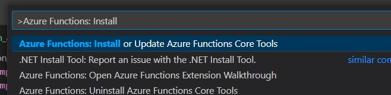

## Windows based Local Machine Setup

[Download and Install Python 3.9.1.2](https://www.python.org/downloads/release/python-3912/)

Scroll down for the package you need
click Download and Install.

[Download and Install VS Code](https://code.visualstudio.com/Download)

[Install Python Extension for VS Code](https://marketplace.visualstudio.com/items?itemName=ms-python.python)

[Install Azure Extension for VS Code](https://marketplace.visualstudio.com/items?itemName=ms-azuretools.vscode-azurefunctions)

Install Azure Functions Core Tools
_ Within VS Code, select View/Command Palette or CTRL+SHIFT+P
_ Type in: Azure Functions: Install

    * Click the first option:   Azure Functions: Install or Update Azure Functions Core Tools
    * Follow the steps and install it

[Install the Azurite emulator](https://marketplace.visualstudio.com/items?itemName=Azurite.azurite)

[Install Node JS](https://nodejs.org/en/download/)
