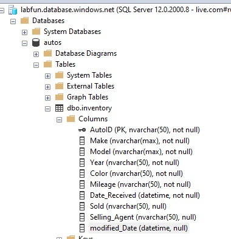

# Hands-On Lab Azure SQL Setup

## Setup Azure Resource Group

First, you will need an Azure Subscription to move forward. If you do great, please continue.  
After logging in via the Azure Portal, Create a resource group. I called mine lab 1.

  


After creation, ensure you're in the resource group via the Azure Portal:

  


## Setup Azure SQL Server and DB

Create an Azure SQL Server. Within lab1 resource group, click the Create button and search for Azure SQL.

  


Select Create, Azure SQL and select Single Database Option and click Create

  


Under Project Details, selected my subscription and my new lab1 resource group.
Under Database details, typed autos for the databasename

  


For Server, click Create new
Provide a unique name for the Server and select Use both SQL and Microsoft Entra authentication.
for Set Microsoft Entra Admin, select an Azure identity.
Fill out your Server Admin login and password. Important - Don't forget what you set here.

  


Back on the Create SQL Database page.

    * Want to use SQL elastic pool?  No
    * Workload environment:  Development
    * Compute + Storage:  I left it as default
    * Backup Storage redundancy:  Locally-redundant storage

  


Click next: Networking button
_ connectivity method: public endpoint
_ Allow Azure Services and resources to access this server: Yes \* Add current client IP address: Yes

  


    * Remaining options default and click review + create.
    * On the create sql database overview page, click create button

  


## Download and Install SQL Management Studio

Download and Install SQL Management Studio from here: [Download SQL Server Management Studio (SSMS)](https://learn.microsoft.com/en-us/sql/ssms/download-sql-server-management-studio-ssms?view=sql-server-ver16)

Connect to sql server and import the schema and table to your database.
Launch SQL Server Management Studio and connect to your Azure SQL DB Server

For Example, mine is:

  


Input your username in UPN format above and hit connect.

After successful connection

  


## Create a new table with entries

Within a new sql query window, run the following sql query:

```
	SET DATEFORMAT ymd
	SET ARITHABORT, ANSI_PADDING, ANSI_WARNINGS, CONCAT_NULL_YIELDS_NULL, QUOTED_IDENTIFIER, ANSI_NULLS, NOCOUNT ON
	SET NUMERIC_ROUNDABORT, IMPLICIT_TRANSACTIONS, XACT_ABORT OFF
	GO

	CREATE TABLE inventory (
	    AutoID nvarchar(50) PRIMARY KEY,
	    Make nvarchar(max) NOT NULL,
	    Model nvarchar(max) NOT NULL,
		Year nvarchar(50) NOT NULL,
		Color nvarchar(50) NOT NULL,
		Mileage nvarchar(50) NOT NULL,
		Date_Received datetime NOT NULL,
		Sold nvarchar(50),
		Selling_Agent nvarchar(50),
		modified_Date datetime
	);

	INSERT autos.dbo.inventory(AutoID, Make, Model, Year, Color, Mileage, Date_Received, Sold, Selling_Agent, modified_Date) VALUES (N'1', N'Ford', N'Mustang', N'2015', N'Silver', N'75000', '2023-09-29 20:23:05.700', N'Yes', NULL, '2023-10-02 21:11:32.597')
	INSERT autos.dbo.inventory(AutoID, Make, Model, Year, Color, Mileage, Date_Received, Sold, Selling_Agent, modified_Date) VALUES (N'2', N'Ford', N'Bronco', N'2021', N'Black', N'25000', '2023-09-29 20:23:37.900', N'No', NULL, '2023-10-02 21:11:19.860')
	INSERT autos.dbo.inventory(AutoID, Make, Model, Year, Color, Mileage, Date_Received, Sold, Selling_Agent, modified_Date) VALUES (N'3', N'Toyota', N'Camry', N'2018', N'Pink', N'90000', '2023-09-29 20:33:04.237', N'No', NULL, '2023-10-03 18:44:27.567')
	INSERT autos.dbo.inventory(AutoID, Make, Model, Year, Color, Mileage, Date_Received, Sold, Selling_Agent, modified_Date) VALUES (N'4', N'Nissan', N'Rogue', N'2022', N'White', N'15000', '2023-09-29 20:33:58.893', N'No', NULL, '2023-10-02 21:19:41.390')
	INSERT autos.dbo.inventory(AutoID, Make, Model, Year, Color, Mileage, Date_Received, Sold, Selling_Agent, modified_Date) VALUES (N'5', N'Nissan', N'GTR', N'2015', N'Black', N'12000', '2023-09-29 20:34:36.720', N'No', NULL, '2023-10-02 21:11:19.860')
	INSERT autos.dbo.inventory(AutoID, Make, Model, Year, Color, Mileage, Date_Received, Sold, Selling_Agent, modified_Date) VALUES (N'6', N'Chevy', N'Camaro', N'2018', N'Orange', N'62000', '2023-09-29 20:35:07.520', N'No', NULL, '2023-10-02 21:11:19.860')
	INSERT autos.dbo.inventory(AutoID, Make, Model, Year, Color, Mileage, Date_Received, Sold, Selling_Agent, modified_Date) VALUES (N'7', N'Hyundai', N'Veloster', N'2017', N'White', N'78000', '2023-09-29 23:24:37.880', N'No', NULL, '2023-10-02 21:11:19.860')
	INSERT autos.dbo.inventory(AutoID, Make, Model, Year, Color, Mileage, Date_Received, Sold, Selling_Agent, modified_Date) VALUES (N'8', N'Honda', N'Accord', N'2021', N'Brown', N'53000', '2023-09-29 23:27:11.547', N'No', NULL, '2023-10-02 21:11:19.860')
GO
```

Now refresh and you should see the following:

  


Running a select \* sql query shows the table is populated:

  


## Create SQL Authentication account

Create a SQL Auth account that will be used by the Azure Function App
Within SQL Management Studio, open a new query window and leverage the sample below.
Ensure you update your password with your desired password.

```
	CREATE LOGIN funcusr WITH PASSWORD = 'password';
	GO

	use autos;
	CREATE USER funcusr FOR LOGIN funcusr;
	GO
	EXEC sp_addrolemember 'db_datareader', 'funcusr';
	EXEC sp_addrolemember 'db_datawriter', 'funcusr';
	GO

```

Run a new SQL Query to ensure the account is present

```
USE master;
	SELECT name, type_desc
	FROM sys.sql_logins
	WHERE type_desc = 'SQL_LOGIN'

```

  

